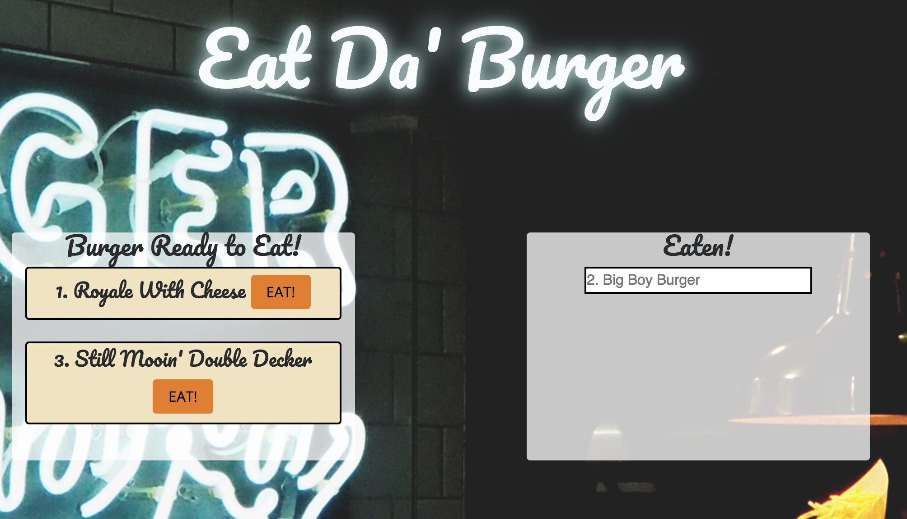

# Burger Logger

This simple app is an exercise in creating a full-stack website using Handlebars templates and Sequelize as a MySQL ORM.

Upon loading, the website will load all the burgers that are currently in the database. The burgers are sorted into two columns based on whether they have been eaten or not. Users can then take two actions. 
1. They can input the name of a new burger that will be created in the database and then added to the "Ready to eat" column or ...
2. They can click the `Eat!` button next to a burger to eat it. This will change its status in the database and cause it to be displayed in the "Eaten" column.

The project follows a MVC pattern. The Views folder contains the Handlebars tempates for the page. The model, which is a MySQL database that we access using Sequelize. Our controller uses Express to render the database query results to the web page. 

### Config for your database

To run this program locally, you must edit the `config.js` file with your username, password, host, and database name so you can persist the data.  
